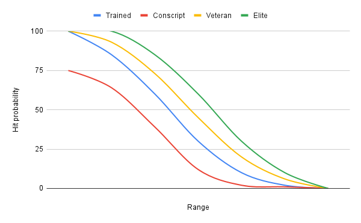

## Shooting

Combat is a stressful activity, most likely *the most stressful* activity a person can find themselves in (Kensing K. (2015). The Most Stressful Jobs of 2014. Carlsbad, CA: Adicio).

In a study on [Norwegian Special Forces](https://www.ncbi.nlm.nih.gov/pmc/articles/PMC9200070/) the accuracy opened up from ca. 0.55 mrad to 0.7 after exercise. With this as a base and then considering most soldiers in WW2 were NOT special forces it is decided that the average accuracy of an infantryman is 4 mrad when taking the guns and ammunition into account. Which means that a shot will be placed within a 40cm circle at 100 meters (16 in @ 110 yards).

The game calculates hit probability based on the range, the gun (pistols and submachineguns have significant drawbacks outside a certain range) and the level of suppression on a soldier. Morale has no effect on hit probability, but a panicked soldier might very well choose to cower instead of exposing himself in order to take a shot. 

More experienced soldiers are assumed to have had more time behind their gun(s) and of course recieve a decreased mrad-rating. See [experience](Experience.md)

### Hit calculation

On average a soldier needs 2 shots to hit a standing target, in the open, at 200 meters. (SoldF 2001). This decreases to 10 for a prone target and 20 for a target in cover. If the target is moving this of course decreases the hit probability. For game purposes we assume that if a *trained* soldier in your unit sees a target standing in the open at 100 meters that target will be hit. A *conscripted* soldier will hit 75% of the time. While an *elite* soldier hits at a range of 200 meters. 

Now of course no unit in the game will stand straight up and chitchat with the other people in the platoon. Not to mention that the soldier shooting is at a 2-way range, so suppression usually factors in after the first shot. Ambushes are supposed to be deadly. Use scouts!

#### The effect of range on hit probability

In normal circumstances a rifle of the era could reach out to 2km (sometimes longer) and still be deadly, and I bet you can hit a propane tank at 1000 yards all day with your Mosin-Nagant. In the game there is a limit of 600 meters for small arms fire. After that it's just a lot of calculating to be done in order to return "the shot missed". Machine guns are excempt to this max range in order to be effectively used for suppression.

##### mrad, experience and range
| Experience | Mrad | Hit % 100m | 200m | 300m | 400m | 500m | 600m |
| ---- | ----------------- | -- | -- | -- | -- | -- | -- |
|Conscript: | 6 mrad | 75 | 64 | 39 | 12 | 2 | 1 |
|Trained: |    4 mrad (baseline) | 100 | 80 | 50 | 25 | 10 | 1 |
|Veteran: |    3 mrad | 100 | 93 | 73 | 45 | 20 | 6 |
|Elite: | 	   2 mrad | 100 | 100 | 85 | 60 | 30 | 10 |

